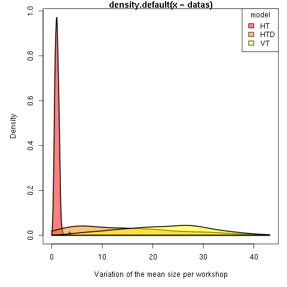

# apemcc
Amphora Production, an Evolutionary model of culture change


## Basic  Usage:
If you want to run just one simulation you need to use `main.py` and give to this script the good argument:

### run

```bash
python model/main.py -w <number of Workshop> -t <time> -f <outputfile> -m <model> -i <init> -a <alpha>
```

* `time` is the total number of time step of the simulation 
* `init` should be in `{"art","file"}`
* `model` should be in `{"HT","HTD","VT"}`
* `outputfile` wille be use to write and store the results of the model
* `alha` new gradual bias (-1 = HT, .5 = HTD, 1 = VT)

If `-i file` is used `-w` is not use

### analyse
If you use let say:

```bash
python main.py -w 10 -t 10000 -f singletest -m HT -i "art" -a 10
```

the model will create a file: `singletest_N10.csv` and you can analyse it with R and some of the tools available in 
* `scripts/apemccAnalysis.R`  
* `scripts/testBetaFunction.R`  

For exemple to see how the exterior rim change between workshops:
```R
model=read.csv("../singletest_N10.csv")  
boxplot(model$exterior_diam ~ model$dist,ylab="exterior_rim",xlab="workshop",xaxt="n")
axis(1,labels=levels(model$workshop),at=1:length(unique(model$dist)))
```

Or how the size of exterior rim change through time within the workshop 1:

```R
boxplot(model$exterior_diam[model$workshop == "ws_1"] ~ model$time[model$workshop == "ws_1"],ylab="exterior_rim",xlab="time"")
```


## Simple experiments with Thresholded bias :

As an intermediate way between the single simulation and a full ABC using MPI you can play with the script used to generate the result use for the first versions of the exploration of the model

### Run batch of experiments:

```bash
bash scripts/scriptRunAll.sh store_expe
```

where `folder` is the path to a folder where the results of the experiment will be stored

It should be noted that this is a modification done in order to simulate the first bias with the new `alpha` parameter

### Analysis
This time we have a folder `store_expe` that contains three folder that contains thousand of file like the one analysed in the first section.
To read all that in once one can use `readFolder` from the file `scripts/apemccAnalysis.R`.

A manual way to do that is set in `YSLR_man` function, which correspond to the function used to generate all we use for the YSLR poster.

A quick way to plot all the result :

```R
allresults=lapply(listsubexpe,readFolder)
plotDensities(sapply(lapply(lapply(allresults,getIt),as.data.frame),varSim,vari=var),epsilon=names(allresults))
```

That should gives something like:



Some adjustment could be done, here `varSim` use the default metrics `exterior_diam` and it should be more flexible.

## ABC
### Prepare the folder

To avoid confusion all abc study should be done in the folder `abc/`
```bash
cd abc/
```

We then need the module from Akeret 2016 (the doc for this module is [here](https://github.com/jakeret/abcpmc)) :

```bash
git clone https://github.com/jakeret/abcpmc
```

and we will link the file from Akeret and the model (aka a dirty instal) :

```bash
ln -s ../model .
ln -s ../data .
ln -s abcpmc/abcpmc/*.py . #this suppose abmpc is cloned in the folder `abc/`
```

(obviously those random ln could be done better with a better handling of python modules...)

### Run one experiment:

One this is done we can run the wrapper of the jakeret module `abc/abcpmc-conf.py`

```bash
python abc/abcpmc-conf.py bias
```

Where `bias` has  here two function : it is the prefix that will use to create a folder where the result of the ABC will be stored and it tell `ConformitySimu()` the bias to be used during the simulation. Thus for the current experiments the string `bias` should be one of:  ["neutral","anti","conf"]

By default the step of the ABC will 5 step from 1 to 0.115, with some preselected prior. To change that one should modify this in `abc/abcpmc-conf.py`:
```python
eps = LinearEps(5, 1, 0.115)
prior = TophatPrior([10,100,0,0],[1000,1000,1,1])
```

The number of particles (_ie_ simulations) test is by default 100 and defined here:

```python
sampler = Sampler(N=100, Y=data, postfn=postfn, dist=dist)

```


If nothing is change from the default value one can then run 3 abc for the 3 different bias by doing (from the folder `abc/`)
```bash
for bias in neutral anti conf;
do
    python abcpmc-conf.py 
done
```

__Warning__ : this may take a few seconds/minutes.


With 5 file in each. Each file contains a csv.The rows represent each selected particles (simulation) for this step of the ABC. The columns correspond to the parameters of the selected simulations.

### Analyse the results
The _final_ results can be obtained by comparing the csv file from each folder with the smallest epsilon. That can be done with whatever tools you want to us.

But a simple R script come with the repo that allow to quickly output the main result of the multiples ABC. To use it just link the files from the script to the current `abc/` folder (yes this folder will start to look dirty, should be done another way). And then use `Rscript` to run the script:
```bash
ln ../script/*.R .
Rscript draft.R
```

With the default value  of the ABC as set in `abcpmc-conf.py`, those results are meaningless. More particles should be selected, the smallest epsilon should be smaller and the prior ranges should be wider. 

To be able to do so, `MPI` is almost mandatory. Scripts using mpi can easily be run in Marenostrun using the SLURM job file:  `abc/generic_mnjob.job`. 
At the same time the python mpi module has to be imported and the call to `sampler` has to be slightly adapted. Both thing should be in the `model/*.py` files in commented lines of code.
